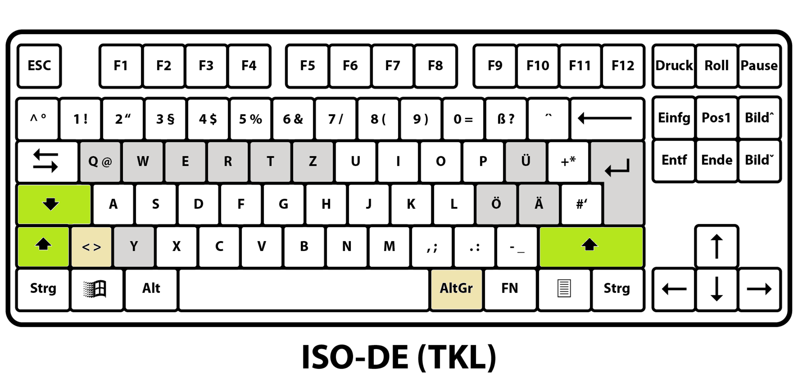
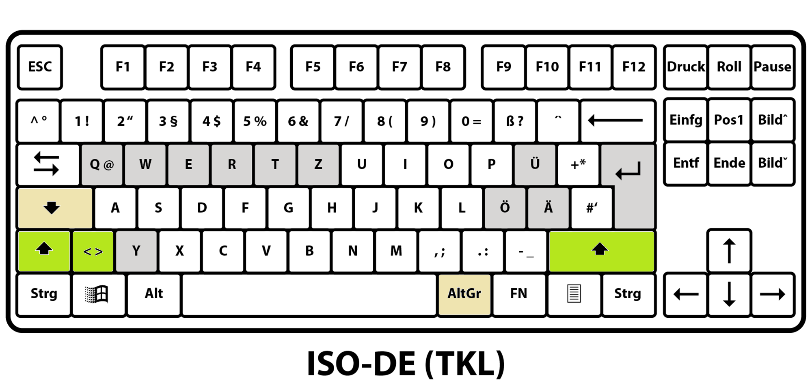
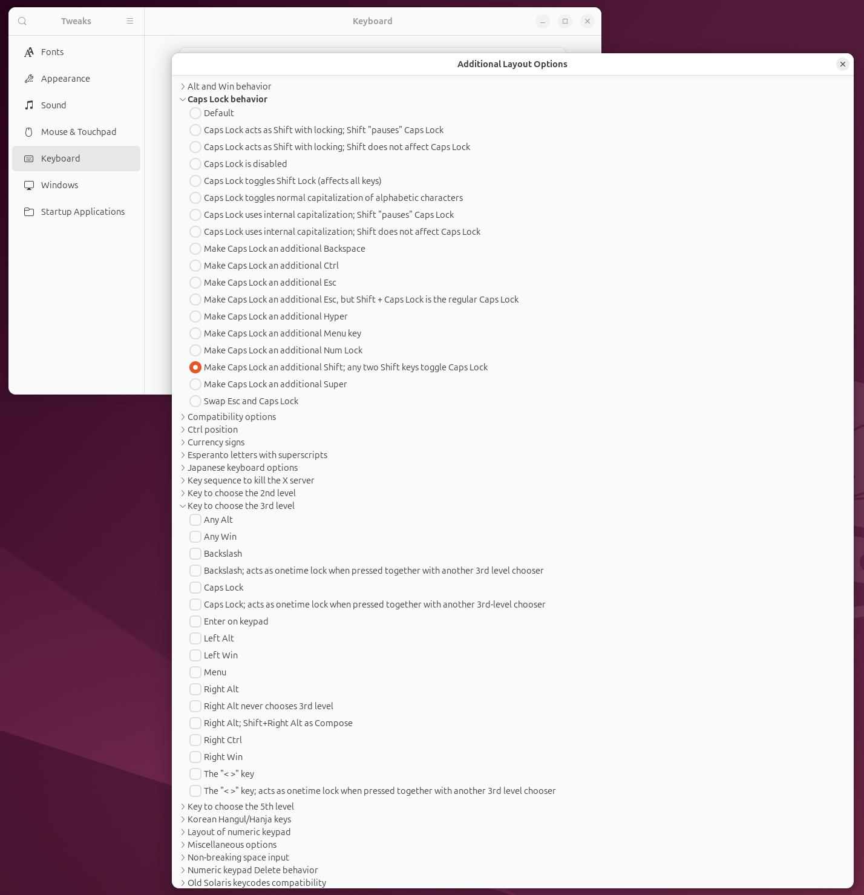

# xkb-caps-as-shift

ISO keyboards have two ergonomic problems compared to the US ANSI layout:
 - the left Shift key is much smaller and further away from standard typing position, making the key hard to reach.
 - a lot of characters are assigned to the AltGr layer on both hands, yet there is only one AltGr on the right hand, 
   thus requiring awkward hand contortions to input any AltGr character on the right side of the keyboard.

With this project, you can fix both problems on your Linux computers by adding a better left Shift key and a left AltGr key.

Here are the default choices that I recommend, but the configuration allows you to pick any combination:

I personally use CapsLock as Shift and put AltGr below:

I like this better, because Shift is used much more frequently, not only for capital letters, but also for the most frequent punctuation characters. 
Therefor I put it in the best position.

But you can also virtually restore the ANSI left Shift key and use CapsLock as AltGr:


In all cases, the existing CapsLock functionality can be made available, if desired. 
When choosing so, you can press two shift keys together for locking Caps mode 
and press any Shift key to end the lock mode.

## Why is this tool needed?

Most of these mappings already exist in xkb. The problem is getting at them:


- relevant options are scattered across four different option groups, so nothing shows you the
  behavior of one key in one place;
- the groups do not agree with each other. Gnome's UI lets you pick only one entry from
  the "Caps Lock behavior" group, but you can happily select "Caps Lock chooses the 3rd
  level" from another group at the same time — and then that one silently wins;
- and the one mapping that would be most useful, Caps Lock as a plain Shift, is not in
  stock xkb at all.

This project fills in that missing option, and gives you a small tool that makes the
selection consistent. (Fyi, in Gnome Tweaks "2nd level" means the shifted characters, 
"3rd level" means AltGr.)

## What you get

**`caps:shift_modifier`**, a new entry in the standard "Caps Lock behavior" group:

- **Hold Caps Lock** — it shifts, exactly like a Shift key.
- **Shift + Caps Lock** — the classic Caps Lock, toggled on and off.
- **While Caps Lock is on**, pressing Caps Lock switches it back off rather than shifting.
- The Caps Lock **LED keeps working**.
- The two real Shift keys are left alone. Pressing both together does *not* toggle Caps
  Lock unless you ask for it.

**`xkb-caps-options`**, a single-file tool that gives you one exclusive choice per key
across all the option groups that compete for it, and leaves the rest of your keyboard
settings alone.

## Requirements

- **A Wayland session.** The option is installed into your home directory, and only
  libxkbcommon — which is what Wayland compositors use — reads keyboard config from there.
  An X11 session compiles its keymap with the X server's own `xkbcomp`, which never looks
  in your home directory, so this will not work there. The tool checks and says so.
- **Gnome**, for the settings part. The keymap files themselves work under any Wayland
  compositor; only the reading and writing of the option list is Gnome-specific. KDE keeps
  its list somewhere else and is not supported yet.
- **Python 3.10 or newer**, which every current Gnome system already has.

## Installing

Download the tool, read it, run it once:

```sh
curl -fsSLO https://raw.githubusercontent.com/matey-jack/xkb-caps-as-shift/main/xkb-caps-options.py
less xkb-caps-options.py       # this is the whole product, not a bootstrap
python3 xkb-caps-options.py --install
```

That copies it to `~/.local/bin` and makes it executable — without the extension — so
every later run is just `xkb-caps-options`. It tells you if `~/.local/bin` is not on your
`PATH`. Running `--install` again is a no-op that re-checks everything, so it doubles as
the update path.

Nothing is written to `~/.config/xkb` at this point, and for most of what the tool does,
nothing ever needs to be: every choice except Caps Lock as Shift is a stock xkb option.
The keymap files are written the first time you actually pick that one, and the tool
shows you what it is about to write, backs up anything already there, and compiles the
result to check it before switching the option on.

## Using it

Run it with no arguments for the menu:

```sh
xkb-caps-options
```

It asks three questions, each with your current setting preselected, and then prints the
resulting option list with a description for every entry.

| question                              | what it can set                                                                                |
|---------------------------------------|------------------------------------------------------------------------------------------------|
| Caps Lock                             | unchanged · Shift (`caps:shift_modifier`) · AltGr (`lv3:caps_switch`) · disabled (`caps:none`) |
| the `LSGT` key                        | the layout default · Shift (`lv2:lsgt_switch`) · AltGr (`lv3:lsgt_switch`)                     |
| both Shifts together toggle Caps Lock | no · yes (`shift:both_capslock_cancel`, so one Shift alone switches it back off)               |

If your Caps Lock is currently set to something that is not on that list — `ctrl:nocaps`
and `caps:escape` are the common ones — it appears as an extra, preselected entry, so
answering with Enter throughout changes nothing.

The same thing without the menu:

```sh
xkb-caps-options --get
xkb-caps-options --set caps=shift,lsgt=altgr,both-shift-caps=yes --dry-run
xkb-caps-options --set caps=shift,lsgt=altgr,both-shift-caps=yes
```

Slots are `caps`, `lsgt`, `both-shift-caps`; values are the keys in the table above
(`default`, `shift`, `altgr`, `none`, `yes`, `no`) plus `keep`. Any slot you do not
mention keeps its current value, and re-running the same command is a no-op.

### What it will not do

Your option list almost certainly holds entries this project has no opinion about —
`grp:` for layout switching, `compose:`, `terminate:`, `nbsp:`, `numpad:`. The tool reads
the list, replaces only the entries belonging to the three questions above, and writes
the rest back untouched. It never resets the whole list.

The mapping applies immediately; no logout needed. Gnome Settings and Tweaks read the
list of *available* options once at startup, so a newly written option only appears in
their menus after those apps restart.

## Checking that it worked

Beyond just typing a capital letter:

```sh
xkbcli compile-keymap --options caps:shift_modifier | grep -A3 'key <CAPS>'
```

should print

```
	key <CAPS>               {
		type= "ALPHABETIC",
		symbols[Group1]= [         Shift_L,       Caps_Lock ]
	};
```

`xkbcli` comes from `libxkbcommon-tools` on Debian and Ubuntu. The tool offers to install
it, and uses it for exactly this check before switching an option on. If you decline, it
carries on and says plainly that the setting was written unverified.

## Uninstalling

```sh
xkb-caps-options --uninstall
```

removes the options it manages from your list — leaving everything else in place — takes
its lines back out of `~/.config/xkb/rules/evdev` and `evdev.xml`, deletes
`~/.config/xkb/symbols/capslock_shift`, and finally removes itself from `~/.local/bin`.
Files it touches are backed up first, and any file that turned out to hold something of
yours is left alone with a note saying so.

## Development

`config/xkb/` mirrors `$XDG_CONFIG_HOME/xkb/` and is the source of truth for the three
keymap files; the tool carries a copy of them as string constants and uses the files
directly when it runs from a checkout. `python3 xkb-caps-options.py --regen-embedded` refreshes
that copy, and CI fails if it has drifted.

```sh
python3 -m unittest discover -s tests -v   # the tool
./tests/check-keymaps.sh                   # the keymaps, needs xkbcli and xkbcomp
```

[`scope.md`](scope.md) says what the project is for and where its boundaries are;
[`tech-specs.md`](tech-specs.md) covers how the tool is installed, modelled, and tested.

## License

MIT — see [LICENSE](LICENSE).
